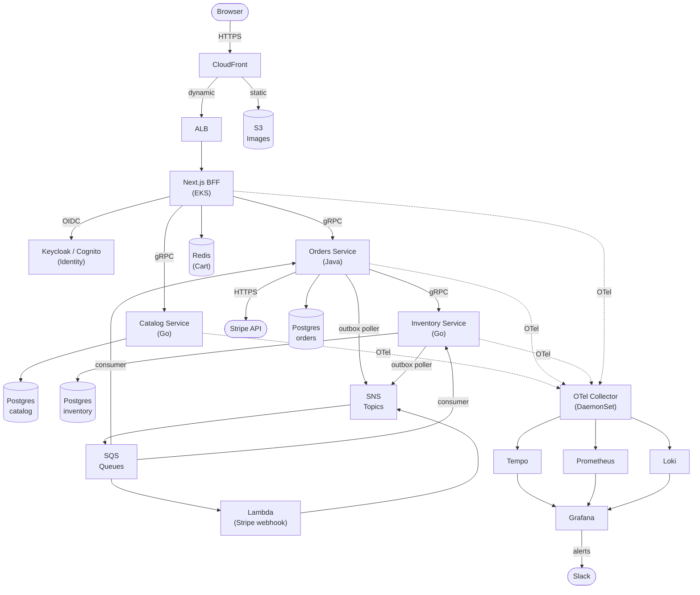

# 03 — Architecture

## Principles

1. **One bounded context per service.** Services are not nouns (product, user, order) — they are domains of responsibility. Noun-per-service explodes into chatty distributed monoliths.
2. **Databases are private.** No service reads another service's tables. Data sharing is via API or events.
3. **gRPC for sync, events for async.** REST only at the edge.
4. **Idempotency everywhere.** Every mutating operation accepts and respects an idempotency key.
5. **Outbox pattern for event publishing.** Never dual-write to DB and message bus.
6. **Observability is not optional.** Every service emits traces, metrics, and structured logs from day one.
7. **Infrastructure is code.** If it's not in Terraform, it doesn't exist.

## System context

## Services (MVP)

### Catalog (Go)
**Owns:** Products, categories. **Reads:** nothing external. **Writes:** its own DB only.

**APIs (gRPC):**
- `ListProducts(filter, pagination) → products[]`
- `GetProduct(id) → product`
- `GetProductsByIds(ids[]) → products[]` (used by Orders for price snapshot)
- `ListCategories() → categories[]`

**Internal:**
- Seed script for initial product data
- Image upload goes through a signed S3 URL, Catalog records the S3 key

**Scaling:** Stateless, horizontally scalable. Read replicas for the DB if needed.

### Orders (Java/Spring)
**Owns:** Orders, the saga state machine, Stripe integration (MVP). **Reads:** nothing external via DB. **Writes:** its own DB + outbox.

**APIs (gRPC):**
- `CreateOrder(cart, address, idempotency_key) → order`
- `GetOrder(id, user_id) → order`
- `ListOrders(user_id, pagination) → orders[]`

**Internal components:**
- Saga orchestrator (Spring `@Service` with explicit state machine)
- Outbox publisher (scheduled task, reads unpublished outbox rows, pushes to SNS, marks published)
- Event consumer (SQS listener for `PaymentCaptured`, `PaymentFailed`)
- Stripe client (webhooks land in Lambda → SNS → SQS → Orders consumer)
- Sweeper (scheduled): cancels orders stuck in PENDING, resolves stuck PAYING via Stripe query

**Why Java here:** Spring's transaction management, strong typing for money (`BigDecimal`, not `double`), and the mature Stripe SDK outweigh the overhead for this transactional core.

### Inventory (Go)
**Owns:** Stock levels and reservations.

**APIs (gRPC):**
- `GetStock(product_id) → available`
- `Reserve(order_id, items[], idempotency_key) → reservation_id`
- `Commit(reservation_id) → ok`
- `Release(reservation_id) → ok`

**Internal components:**
- Event consumer for `OrderConfirmed` (commit) and `OrderFailed` (release)
- Reservation sweeper: expires reservations past TTL, releases stock

**Concurrency:** Reservations use optimistic locking (version column) on the stock row to avoid oversell under concurrent load.

## Communication patterns

### Synchronous (gRPC)

Use when the caller needs an immediate answer and the callee is expected to be available.

- Orders → Catalog: fetch authoritative prices during order creation.
- Orders → Inventory: reserve stock, commit, release.
- BFF → any service: for request-scoped reads and writes.

**Rules:**
- Deadlines on every call (`context.WithDeadline` / `CallCredentials`).
- Retries with exponential backoff ONLY on idempotent operations.
- Circuit breaker pattern via gRPC middleware.
- Trace context propagated in metadata.

### Asynchronous (SNS + SQS)

Use when the producer shouldn't block on the consumer, or when multiple consumers need to react.

**Topics (SNS):**
- `order-events` — `OrderPlaced`, `OrderConfirmed`, `OrderFailed`, `OrderCancelled`
- `payment-events` — `PaymentAttempted`, `PaymentCaptured`, `PaymentFailed`
- `inventory-events` — `StockReserved`, `StockReleased`, `StockCommitted`, `StockDepleted`

**Queues (SQS):** One per consumer per topic. Dead-letter queues with a redrive policy (3 attempts → DLQ).

**Envelope:** Every event carries `event_id`, `event_type`, `version`, `occurred_at`, `trace_id`, `idempotency_key`, `payload`.

**Consumer rules:**
- Consumers must be idempotent (use `event_id` as dedup key).
- Long-running work happens in background threads, not in the consumer callback.
- Poison messages go to DLQ after N retries; alert fires.

## Transactional outbox pattern

The dual-write problem: if a service writes to its DB and publishes an event as two separate operations, a crash between them causes inconsistency. Solution:

1. Write the event to an `outbox` table in the same DB transaction as the business change.
2. A separate poller reads unpublished outbox rows, publishes to SNS, marks as published.
3. Polling is at-least-once; consumers must be idempotent.

Every service that emits events implements this pattern. No exceptions.

## Saga orchestration (Orders)

Orders is the orchestrator; Inventory and Payments are participants.

**Steps and compensations:**

| Step | Action | Compensation |
|---|---|---|
| 1 | Write Order (PENDING) + outbox | Mark Order FAILED |
| 2 | Reserve inventory | Release reservation |
| 3 | Capture payment (Stripe) | Void / refund (N/A if capture failed) |
| 4 | Confirm order, publish OrderConfirmed | — (terminal success) |

**State persistence:** Saga state lives in the Orders table itself (not a separate state table for MVP). Each step's completion flips a status column within a transaction.

**Recovery:** On service start, a recovery worker scans orders in non-terminal states older than N seconds and resumes. Each step is idempotent so replays are safe.

## Data ownership summary

| Data | Owner | Shared via |
|---|---|---|
| Products, prices | Catalog | gRPC read API |
| Users, credentials | Keycloak/Cognito | OIDC / JWT |
| Cart | BFF (Redis) | Session cookie |
| Orders | Orders | gRPC read API + events |
| Stock, reservations | Inventory | gRPC read API + events |
| Payment intents | Orders (MVP) | — |

## Deployment topology (AWS)

- **Single region** — us-east-1 (cheapest, biggest service selection).
- **Two AZs minimum** for RDS multi-AZ and EKS node distribution.
- **Private subnets** for services, databases, Redis; **public subnets** for load balancers and NAT.
- **One NAT gateway** for cost (accept the SPoF for learning env).
- **One EKS cluster**, multiple node groups (general purpose, can add spot later).
- **One RDS instance per service** (not one shared RDS with multiple databases — that's a smell).

## Observability architecture

### Traces
- OpenTelemetry SDK in every service (auto-instrumentation where available).
- Trace context propagated through gRPC metadata and SNS message attributes.
- Sampled at 100% in dev, configurable in higher envs.
- Tempo stores traces; Grafana visualizes.

### Metrics
- Prometheus scrapes `/metrics` endpoints via ServiceMonitor CRDs.
- Each service exposes RED metrics (Rate, Errors, Duration) plus domain metrics (orders created, reservations failed, etc).
- Prometheus + kube-state-metrics + node-exporter for infra.

### Logs
- Structured JSON logs to stdout (Loki picks up via Promtail DaemonSet).
- Every log line includes `trace_id`, `span_id`, `service.name`, `order_id` (where applicable).
- No PII in logs.

### Alerting
- Alertmanager → Slack webhook.
- Rules: high error rate (>1% for 5m), saga failure spike, DLQ non-empty, high p95 latency, pod CrashLoopBackoff.

## Security architecture

- All service-to-service calls on private network.
- Ingress terminates TLS at ALB; internal cluster traffic is plaintext HTTP/2 in MVP (mTLS via service mesh is Phase 2).
- JWTs validated at the BFF; downstream services trust `x-user-id` / `x-user-roles` headers from the BFF (protected by network policy — only BFF can set these).
- Secrets in AWS Secrets Manager, surfaced as Kubernetes Secrets via External Secrets Operator.
- IAM roles for service accounts (IRSA) — no long-lived AWS credentials anywhere.
- Database passwords rotated (Secrets Manager rotation for RDS).

## Failure modes considered

| Failure | Mitigation |
|---|---|
| Service pod crashes | Kubernetes restarts; saga resumes on next poll |
| Database connection exhausted | HikariCP / pgbouncer limits + HPA on services |
| Stripe API slow | Timeout + async webhook reconciliation |
| SNS publish fails after DB commit | Outbox retries publish |
| Duplicate event delivery | Consumer idempotency via `event_id` dedup |
| Reservation commit happens but release event is lost | Sweeper resolves via state reconciliation (Phase 2 refinement) |
| Clock skew across services | All timestamps from DB or with explicit source annotation |
