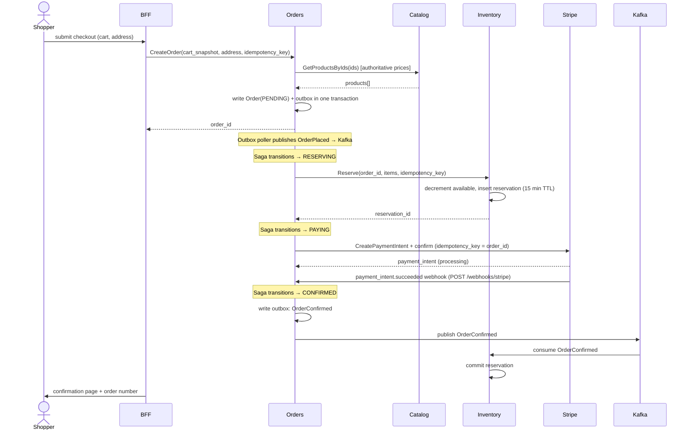
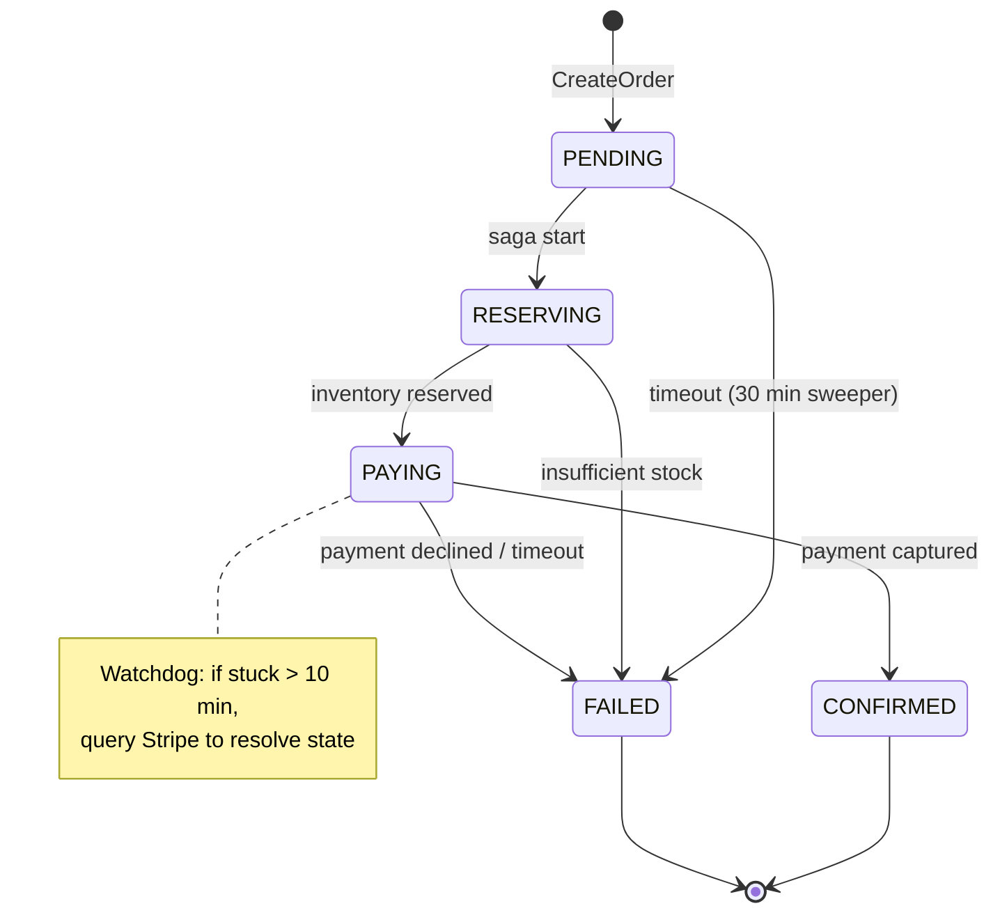
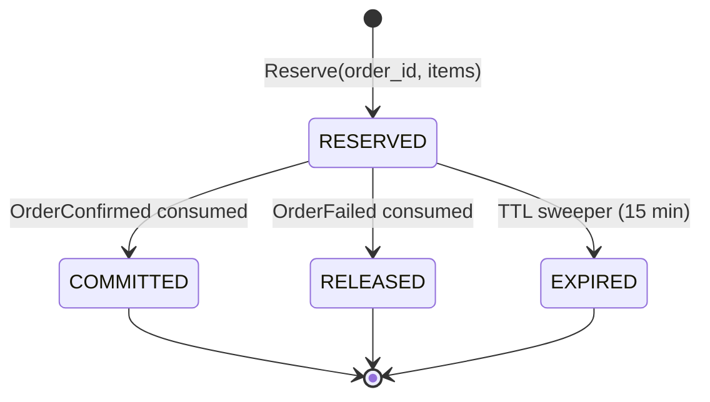

# 02 — Business Logic and Use Cases

## Domain overview

The platform sells gaming PC components and peripherals. The domain divides into six bounded contexts, each owned by exactly one service. Services never reach into each other's data.

| Bounded context | Service (MVP) | Responsibilities |
|---|---|---|
| Catalog | Catalog | Products, categories, specs, images, prices |
| Identity | Keycloak/Cognito (managed) | Users, credentials, JWT issuance |
| Cart | Next.js BFF + Redis | Session carts, pricing summary |
| Ordering | Orders | Order lifecycle, saga orchestration |
| Stock | Inventory | Stock levels, reservations, commits, releases |
| Payments | Orders (in MVP) / Payments (Phase 2) | Stripe integration, capture, refunds |

Later bounded contexts (Notifications, Search, Reviews, Recommendations) are deferred.

## Domain entities (MVP)

Full column-level schema is in `docs/09-data-model.md`. This section is the conceptual summary.

### Product
Owned by Catalog (`gg_catalog`). Holds SKU, name, brand, category, specs (JSONB), price in cents, and a denormalised `stock_status` display hint updated by Inventory events.

### Category
Owned by Catalog. Single-level tree. ID is a slug string (`'gpus'`, `'cpus'`).

### User
Owned by Identity (Keycloak — external). Services never store user credentials or PII. Downstream services receive `user_id` (the JWT `sub` claim) as a plain string — no foreign key in any service DB.

### Cart
Lives in Redis. Not a database table. Keyed by session ID (guest) or user ID (authenticated).
- Value: `[{product_id, quantity, unit_price_cents_at_add_time}]`
- TTL: 7 days (guest), 30 days (authenticated)

### Order
Owned by Orders (`gg_orders`). Status machine: `PENDING → RESERVING → PAYING → CONFIRMED / FAILED`. Price snapshot and shipping address are stored at creation time and never mutated. Companion tables: `order_line_items`, `outbox`, `payment_events`, `idempotency_keys`.

### Stock / Reservation
Owned by Inventory (`gg_inventory`). `stock` holds available/reserved counts with an optimistic-lock `version` column. `reservations` holds per-order-per-product reservations with a 15-minute TTL. Companion table: `outbox`.

### Payment
Phase 2 entity. In MVP, payment state is tracked via `orders.payment_intent_id` and the `payment_events` audit table (one row per Stripe webhook received).

## Actors

- **Guest** — unauthenticated visitor, can browse and add to cart
- **Shopper** — authenticated user, can check out
- **System** — background processes (saga orchestrator, outbox publisher, reservation expiry)
- **Operator** — you, via Grafana; no direct UI

## Use cases (MVP)

### UC-01: Browse catalog
**Actor:** Guest or Shopper.
**Flow:**
1. User visits storefront; Next.js server-renders landing page with featured products (call to Catalog gRPC `ListProducts`).
2. User navigates to category; paginated product list loads.
3. User opens product detail page; Next.js renders full specs and image gallery.

**Non-functional:** Product list should render server-side in <300ms p95. Cacheable at the CDN level for guest traffic.

### UC-02: Register and log in
**Actor:** Guest → Shopper.
**Flow:**
1. User clicks "Sign up"; redirected to Keycloak/Cognito hosted UI.
2. User completes registration; redirected back with OIDC code.
3. Next.js BFF exchanges code for tokens; sets HTTP-only session cookie.

**Out of scope for MVP:** Social login, MFA, email verification (rely on IdP defaults).

### UC-03: Add to cart
**Actor:** Guest or Shopper.
**Flow:**
1. User clicks "Add to cart" on product page.
2. Next.js route handler fetches product from Catalog (for current price), updates Redis cart.
3. Cart badge updates.

**Edge cases:**
- Product price changed since cart was populated → store price at add-time, surface delta at checkout.
- Product discontinued → mark line item as unavailable, exclude from checkout total.

### UC-04: View and edit cart
Standard. Quantity changes recompute line totals client-side; authoritative pricing happens at checkout.

### UC-05: Checkout — happy path
**Actor:** Shopper (authenticated).
**Flow (orchestrated by Orders saga):**

```
1. Shopper submits checkout with shipping address.
2. BFF validates session, calls Orders.CreateOrder(cart_snapshot, address, idempotency_key).
3. Orders:
   a. Starts DB transaction.
   b. Re-fetches current prices from Catalog (gRPC) — authoritative pricing.
   c. Writes Order row (status=PENDING) + outbox event OrderPlaced.
   d. Commits transaction.
4. Outbox poller publishes OrderPlaced to Kafka (`orders.order-created`).
5. Orders saga picks up internal state, transitions to RESERVING.
6. Orders calls Inventory.Reserve(order_id, items, idempotency_key) over gRPC.
7. Inventory:
   a. For each line item: decrement available, increment reserved, insert reservation row with 15min expiry.
   b. Returns reservation_id.
8. Orders transitions to PAYING.
9. Orders calls Stripe PaymentIntent create + confirm (with idempotency key = order_id).
10. Stripe webhook fires → `POST /webhooks/stripe` in Orders service.
11. On payment_intent.succeeded:
    a. Orders transitions to CONFIRMED, writes outbox event OrderConfirmed.
    b. Inventory consumes OrderConfirmed, commits reservation (decrements reserved, no change to available since it was already decremented).
12. User sees confirmation page with order number.
```

**Sequence diagram — happy path:**



### UC-06: Checkout — failure paths (compensations)

**Insufficient stock:**
- Inventory.Reserve returns FAILED_PRECONDITION for specific items.
- Orders transitions to FAILED, no payment attempted, no compensation needed (reservation never succeeded).
- User sees "One or more items are no longer available" with updated cart state.

**Payment declined:**
- Stripe returns card_declined.
- Orders transitions to FAILED, publishes OrderFailed.
- Inventory consumes OrderFailed, releases reservation (decrements reserved, re-increments available).
- User sees error, can retry with different payment method.

**Service crash mid-saga:**
- Orders row persists with intermediate status (e.g. RESERVING).
- On service restart, saga recovery worker scans orders in non-terminal states older than N seconds, resumes based on idempotent step markers.
- Reservations have 15-minute TTL; expired reservations are auto-released by a sweeper.

**Stripe webhook never arrives:**
- Orders has a watchdog: orders in PAYING > 10 minutes trigger a Stripe API query to resolve final state.

### UC-07: Order confirmation and tracking (MVP-lite)
- Confirmation page shown after successful checkout.
- User can view past orders on `/account/orders` (Orders.ListOrders by user_id).
- Order detail page shows status and line items.
- Email is NOT sent in MVP — only logged. Phase 2 adds Notifications service.

### UC-08: Operator observability workflow
- Operator gets Slack alert for elevated saga failure rate.
- Opens Grafana dashboard, filters to affected service.
- Drills into traces by trace_id; sees the full distributed flow.
- Cross-references logs by trace_id.
- Identifies root cause (e.g. Stripe API latency spike).

This is the "observability is the only debugging tool" experience we're building for.

## Business rules (MVP)

- Prices are snapshotted into the Order at creation time. Catalog price changes after order creation do not affect the order.
- Stock reservations expire after 15 minutes if not committed or released.
- Orders in PENDING for > 30 minutes are auto-cancelled by a sweeper.
- An order cannot be modified after CONFIRMED in MVP (no edits, no cancellations post-confirmation). Refunds are Phase 2.
- Currency is USD everywhere.
- Tax is a flat 8% added at checkout (hardcoded).
- Shipping is a flat $9.99 (hardcoded).
- Idempotency: every mutating API accepts an `Idempotency-Key` header. Same key within 24 hours returns the cached response.

## State diagrams

### Order lifecycle



### Reservation lifecycle (Inventory)



## Open domain questions

These need a decision before implementation but don't block planning:

1. Guest checkout (buy without registering) — yes or no? *Tentative: no for MVP to reduce surface area.*
2. Stock oversell tolerance — strict (never oversell) or soft (allow small negative with alert)? *Tentative: strict.*
3. Order number format — UUID or human-friendly (e.g. `GMR-2026-00042`)? *Tentative: human-friendly.*
