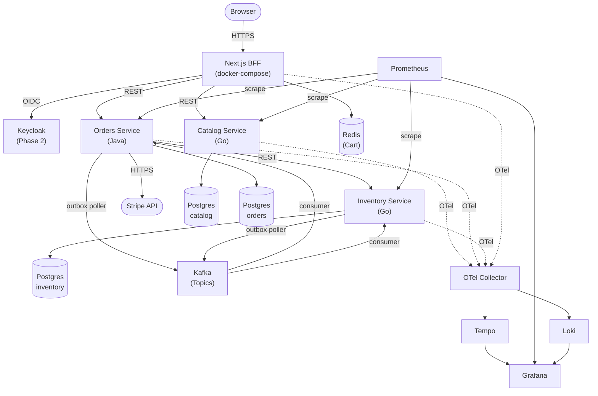

# 03 — Architecture

## Principles

1. **One bounded context per service.** Services are not nouns (product, user, order) — they are domains of responsibility. Noun-per-service explodes into chatty distributed monoliths.
2. **Databases are private.** No service reads another service's tables. Data sharing is via API or events.
3. **REST for sync, events for async.**
4. **Idempotency everywhere.** Every mutating operation accepts and respects an idempotency key.
5. **Outbox pattern for event publishing.** Never dual-write to DB and message bus.
6. **Observability is not optional.** Every service emits traces, metrics, and structured logs from day one.
7. **Infrastructure is code.** If it's not in `docker-compose.yml`, it doesn't exist.

## System context

## Services (MVP)

### Catalog (Go)
**Owns:** Products, categories. **Reads:** nothing external. **Writes:** its own DB only.

**APIs (REST):**
- `GET /products` — list products with filter and pagination
- `GET /products/{id}` — get product by ID
- `GET /products?ids=...` — get products by IDs (used by Orders for price snapshot)
- `GET /categories` — list categories

**Internal:**
- Seed script for initial product data
- Image upload goes through a signed S3 URL, Catalog records the S3 key

**Scaling:** Stateless, horizontally scalable. Read replicas for the DB if needed.

### Orders (Java/Spring)
**Owns:** Orders, the saga state machine, Stripe integration (MVP). **Reads:** nothing external via DB. **Writes:** its own DB + outbox.

**APIs (REST):**
- `POST /orders` — create order (with idempotency key)
- `GET /orders/{id}` — get order by ID
- `GET /orders?user_id=...` — list orders for a user

**Internal components:**
- Saga orchestrator (Spring `@Service` with explicit state machine)
- Outbox publisher (scheduled task, reads unpublished outbox rows, publishes to Kafka, marks published)
- Event consumer (Kafka consumer group for `PaymentCaptured`, `PaymentFailed`)
- Stripe client (webhooks land on `POST /webhooks/stripe` in Orders service)
- Sweeper (scheduled): cancels orders stuck in PENDING, resolves stuck PAYING via Stripe query

**Why Java here:** Spring's transaction management, strong typing for money (`BigDecimal`, not `double`), and the mature Stripe SDK outweigh the overhead for this transactional core.

### Inventory (Go)
**Owns:** Stock levels and reservations.

**APIs (REST):**
- `GET /stock/{product_id}` — get available stock
- `POST /reservations` — reserve stock (with idempotency key)
- `POST /reservations/{id}/commit` — commit reservation
- `POST /reservations/{id}/release` — release reservation

**Internal components:**
- Event consumer for `OrderConfirmed` (commit) and `OrderFailed` (release)
- Reservation sweeper: expires reservations past TTL, releases stock

**Concurrency:** Reservations use optimistic locking (version column) on the stock row to avoid oversell under concurrent load.

## Communication patterns

### Synchronous (REST)

Use when the caller needs an immediate answer and the callee is expected to be available.

- Orders → Catalog: fetch authoritative prices during order creation.
- Orders → Inventory: reserve stock, commit, release.
- BFF → any service: for request-scoped reads and writes.

**Rules:**
- Timeouts on every call (`context.WithDeadline`).
- Retries with exponential backoff ONLY on idempotent operations (GET, PUT).
- Circuit breaker pattern via middleware.
- Trace context propagated in HTTP headers (W3C TraceContext).

### Asynchronous (Kafka)

Use when the producer shouldn't block on the consumer, or when multiple consumers need to react.

**Topics:**
- `orders.order-created` — `OrderPlaced`, `OrderConfirmed`, `OrderFailed`, `OrderCancelled`
- `orders.order-cancelled` — compensation events
- `inventory.stock-reserved` — `StockReserved`, `StockReleased`, `StockCommitted`, `StockDepleted`
- `inventory.stock-released` — reservation releases
- `catalog.product-updated` — product price / stock changes

**Consumer groups:** One consumer group per service per topic. Dead-letter handling via a separate `*.dlq` topic after N retries.

**Envelope:** Every event carries `event_id`, `event_type`, `version`, `occurred_at`, `trace_id`, `idempotency_key`, `payload`.

**Consumer rules:**
- Consumers must be idempotent (use `event_id` as dedup key).
- Long-running work happens in background threads, not in the consumer callback.
- Poison messages go to DLQ after N retries; alert fires.

## Transactional outbox pattern

The dual-write problem: if a service writes to its DB and publishes an event as two separate operations, a crash between them causes inconsistency. Solution:

1. Write the event to an `outbox` table in the same DB transaction as the business change.
2. A separate poller reads unpublished outbox rows, publishes to Kafka, marks as published.
3. Polling is at-least-once; consumers must be idempotent.

Every service that emits events implements this pattern. No exceptions.

### Delivery guarantees in practice (failure modes)

Delivery is **at-least-once**: never lose an event, tolerate duplicates (ADR-019). Two
guards combine to give an **effectively-once** end result — exactly-once *effects* without
Kafka transactions. They cover different duplicate sources; neither alone is sufficient.

**Guard 1 — `FOR UPDATE SKIP LOCKED` (producer side).** The poller claims a batch with
`SELECT … WHERE published_at IS NULL ORDER BY created_at LIMIT n FOR UPDATE SKIP LOCKED`.
`FOR UPDATE` locks the claimed rows until the transaction commits; `SKIP LOCKED` makes a
second poller *step over* already-locked rows instead of blocking. Two pollers therefore take
**disjoint** batches — no row is published twice, no contention. The publish + the
`UPDATE published_at` + the commit all happen in that one transaction, so once the lock
releases the row also no longer matches `published_at IS NULL` (lock + data, two layers).
(In Hibernate this is `@Lock(PESSIMISTIC_WRITE)` + the `jakarta.persistence.lock.timeout=-2`
SKIP-LOCKED hint; in raw pgx it is the literal SQL.)

**Guard 2 — `event_id` dedup (consumer side).** Every event carries a stable `event_id` (UUID
stamped once on the outbox row; survives re-publishes — it is *not* a Kafka offset). Each
consumer keeps a `consumed_events(event_id PRIMARY KEY, …)` table and, in **one transaction**,
checks-then-acts: if `event_id` is already recorded, skip; otherwise do the work **and** insert
the dedup row together. Re-processing the same event is a no-op.

The two duplicate sources `SKIP LOCKED` cannot prevent (they are crashes, not races), and how
Guard 2 neutralises them:

1. **Poller re-publish.** The poller sets `published_at` only *after* the broker ack. Crash
   between ack and commit → the row reverts to `published_at IS NULL` while the Kafka record is
   already durable → on restart it publishes a **second** copy. The consumer sees the same
   `event_id` twice; the second hits the dedup check and is skipped. (Producer
   `enable.idempotence` does **not** help — it only collapses retries *within one `send()`*; a
   re-publish is a separate `send()` / new producer session.)
2. **Kafka redelivery.** Consumer does the work + commits its DB transaction, then crashes
   *before* the container commits the Kafka offset (ack mode `RECORD`, auto-commit off). On
   restart Kafka redelivers from the last committed offset; the dedup row already exists → skip.

**Commit ordering is load-bearing:** the listener's DB transaction (work + dedup row) commits
**first**, the Kafka offset **second**. A crash in the gap re-delivers and is deduped (safe). The
reverse order (offset first) would advance past a record whose work never committed → **silent
loss**. This ordering is the difference between at-least-once and at-most-once.

| Duplicate source | Neutralised by |
|---|---|
| Two pollers grab the same rows | `FOR UPDATE SKIP LOCKED` (disjoint batches) |
| Poller re-publish after crash (ack'd, not committed) | `event_id` dedup |
| Kafka redelivery (offset uncommitted at crash) | `event_id` dedup + DB-before-offset commit order |
| Producer's own in-session send retry | `enable.idempotence=true` (producer-id + seq numbers) |

**Consequence — a hard rule:** every consumer handler must be a pure idempotent function of the
event. A deduped re-delivery is a no-op, so per-event ordering across a duplicate never matters.

## Saga orchestration (Orders)

Orders is the orchestrator; Inventory and Payments are participants.

**Steps and compensations:**

| Step | Action | Compensation |
|---|---|---|
| 1 | Write Order (PENDING) + outbox | Mark Order FAILED |
| 2 | Reserve inventory | Release reservation |
| 3 | Capture payment (Stripe) | Void / refund (N/A if capture failed) |
| 4 | Confirm order, publish OrderConfirmed | — (terminal success) |

**State persistence:** Saga state lives in the Orders table itself (not a separate state table for MVP). Each step's completion flips a status column within a transaction.

**Recovery:** On service start, a recovery worker scans orders in non-terminal states older than N seconds and resumes. Each step is idempotent so replays are safe.

### Recovery & reconciliation in practice (Milestone D3)

Two independent safety nets resume work a crash left behind. Both are timers that
run **in addition to** the normal paths (synchronous saga, terminal Kafka events,
Stripe webhooks) — they only ever do something when the happy path didn't.

**Orders — saga recovery worker** (`SagaRecoveryWorker`, fixed-delay scan, first run
at startup). Loads ids of orders in `{PENDING, RESERVING, PAYING}` and calls
`SagaOrchestrator.recover(id)`:
- `PENDING`/`RESERVING` (or `PAYING` before the PaymentIntent was persisted) → re-enter
  `run()`. Reserve is idempotent (Inventory keys on the request) and pay-initiation is
  idempotent (Stripe key `order-<id>-pi`), so resuming never double-reserves or
  double-charges.
- `PAYING` with a PaymentIntent → **reconcile against Stripe** (`PaymentIntent.retrieve`):
  `succeeded` → confirm, `canceled`/`requires_payment_method` → fail, anything still
  in-flight (`processing`, `requires_action`) → leave for the next scan. This is the
  deliberate **exception to "the webhook is the authority" (ADR-020)**: a *missed* webhook
  is recovered by polling, but polling is the fallback, not the primary path. One failing
  order never blocks the others; a Stripe error just retries next scan.

**Inventory — reservation sweeper** (`Sweeper`, fixed-delay tick). Claims `RESERVED`
rows past `expires_at` (the partial index `idx_reservations_expiry`) and transitions each
to `EXPIRED` — same stock effect as a release (returns it to the pool) — emitting a
distinct `StockExpired` event on `inventory.stock-released`. Idempotent: a reservation the
order's saga concurrently committed/released is skipped (`ErrInvalidTransition`).

**The TTL race (acknowledged).** The sweeper could expire a reservation for an order that
is *legitimately* still `PAYING` (e.g. a very slow webhook), after which a late success
would confirm an order whose stock was already returned. This is bounded, not eliminated,
by ordering the two timers: the **TTL is generous (15 min)** while the **recovery scan is
frequent (≈1 min)**, so a stuck `PAYING` order is almost always reconciled to a terminal
state well before its reservation ages out. A future hardening (out of D3 scope) is for
Orders to consume `StockExpired` and fail the matching order, closing the window entirely.

## Data ownership summary

| Data | Owner | Shared via |
|---|---|---|
| Products, prices | Catalog | REST read API |
| Users, credentials | Keycloak/Cognito | OIDC / JWT |
| Cart | BFF (Redis) | Session cookie |
| Orders | Orders | REST read API + events |
| Stock, reservations | Inventory | REST read API + events |
| Payment intents | Orders (MVP) | — |

## Deployment topology (docker-compose)

All services run in a single `docker-compose` network. Service discovery via container name (e.g., `catalog:8080`, `kafka:29092`, `postgres-catalog:5432`). No ingress controller, load balancer, or VPC needed.

**Port map (host-accessible):**

| Service | Host port | Notes |
|---|---|---|
| postgres-catalog | 5432 | gg-catalog DB |
| postgres-orders | 5433 | gg-orders DB |
| postgres-inventory | 5434 | gg-inventory DB |
| redis | 6379 | cart cache |
| kafka | 9092 | PLAINTEXT — host tools and natively-running services |
| kafka-ui | 8090 | Kafka topic browser |
| otel-collector | 4317, 4318 | OTLP gRPC + HTTP |
| prometheus | 9090 | metrics |
| loki | 3100 | logs |
| tempo | 3200 | traces |
| grafana | 3001 | dashboards (admin/admin) |
| catalog service | 8080 | REST |
| orders service | 8081 | REST |
| inventory service | 8082 | REST |
| storefront (Next.js) | 3000 | BFF + UI |

## Observability architecture

### Traces
- OpenTelemetry SDK in every service (auto-instrumentation where available).
- Trace context propagated through HTTP headers and Kafka message headers (W3C TraceContext).
- Sampled at 100% in dev, configurable in higher envs.
- Tempo stores traces; Grafana visualizes.

### Metrics
- Prometheus scrapes `/metrics` endpoints via static scrape configs in `docker/prometheus.yml`.
- Each service exposes RED metrics (Rate, Errors, Duration) plus domain metrics (orders created, reservations failed, etc).

### Logs
- Structured JSON logs via OTLP to otel-collector → Loki.
- Every log line includes `trace_id`, `span_id`, `service.name`, `order_id` (where applicable).
- No PII in logs.

### Alerting
- Alertmanager → Slack webhook (Phase 4).
- Rules: high error rate (>1% for 5m), saga failure spike, DLQ non-empty, high p95 latency.

## Security architecture

- All service-to-service calls on the docker-compose internal network.
- Ingress is handled by the Next.js BFF; no external load balancer in MVP.
- JWTs validated at the BFF; downstream services trust `x-user-id` / `x-user-roles` headers from the BFF.
- Secrets managed via `.env.local` files (gitignored); never committed.
- Database passwords are static in the local dev compose stack (postgres/postgres); acceptable for local-only dev.
- Dependency scanning via GitHub Dependabot + Trivy in CI for container images.

## Failure modes considered

| Failure | Mitigation |
|---|---|
| Service container crashes | docker-compose `restart: unless-stopped`; saga resumes on next poll |
| Database connection exhausted | HikariCP / pgbouncer limits |
| Stripe API slow | Timeout + async webhook reconciliation |
| Kafka publish fails after DB commit | Outbox retries publish |
| Duplicate event delivery | Consumer idempotency via `event_id` dedup |
| Reservation commit happens but release event is lost | Sweeper resolves via state reconciliation (Phase 2 refinement) |
| Clock skew across services | All timestamps from DB or with explicit source annotation |
